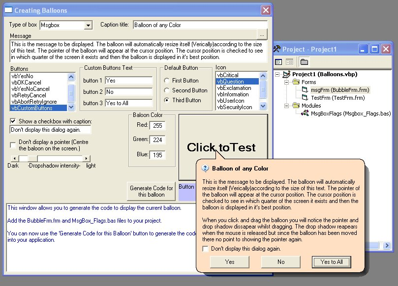



## Balloon Msgboxes, Inputboxes and timeout popups

### Description

Display msgboxes, inputboxes and custom dialogs in balloons of any color you choose with an alphablended drop shadow of varying intensity. This is an update which has been rewritten to take into account users feedback. The code should now be clean and consists of only one form and one enumeration in a module. It is easy to replace the standard vb controls used with usercontrols of your choice to give an XP appearance. All balloons can be positioned via the calling code or just left to appear at the cursor position. Please see the screenshot and leave feedback, thanks.
 
### More Info
 
Function msg_Box(ByVal mPrompt As String, _

ByVal mFlags As MsgBox_Flags, _     ByVal mCaption As String, _

Optional NoPointer As Boolean, _

Optional CheckboxTxt As String, _

Optional Btn1 As String, _

Optional Btn2 As String, _

Optional Btn3 As String, _

Optional mColor As OLE_COLOR, _

Optional X As Single, _

Optional Y As Single, _

Optional Intensity As Integer) As Integer

Function input_box(ByVal mPrompt As String, _

ByVal mFlags As MsgBox_Flags, _

ByVal mCaption As String, _

Optional DefaultText As String, _

Optional NoPointer As Boolean, _

Optional CheckboxTxt As String, _

Optional mColor As OLE_COLOR, _

Optional X As Single, _

Optional Y As Single, _

Optional Intensity As Integer) As String

Function MsgAuto_box(ByVal mPrompt As String, _

ByVal mFlags As MsgBox_Flags, _

ByVal mCaption As String, _

ByVal nTime As Integer, _

Optional NoPointer As Boolean, _

Optional mColor As OLE_COLOR, _

Optional X As Single, _

Optional Y As Single, _

Optional Intensity As Integer) As String

Function msg_Box returns a integer decribing which button was pressed.

Function input_box returns a string decribing the text the user entered.

             |
---                |---
**Submitted On**   |2004-01-31 21:20:02
**By**             |[Chris S Farmer](https://github.com/Planet-Source-Code/PSCIndex/blob/master/ByAuthor/chris-s-farmer.md)
**Level**          |Advanced
**User Rating**    |4.8 (139 globes from 29 users)
**Compatibility**  |VB 5\.0, VB 6\.0
**Category**       |[Miscellaneous](https://github.com/Planet-Source-Code/PSCIndex/blob/master/ByCategory/miscellaneous__1-1.md)
**World**          |[Visual Basic](https://github.com/Planet-Source-Code/PSCIndex/blob/master/ByWorld/visual-basic.md)
**Archive File**   |[Baloon\_Msg1702441312004\.zip](https://github.com/Planet-Source-Code/chris-s-farmer-balloon-msgboxes-inputboxes-and-timeout-popups__1-51231/archive/master.zip)

